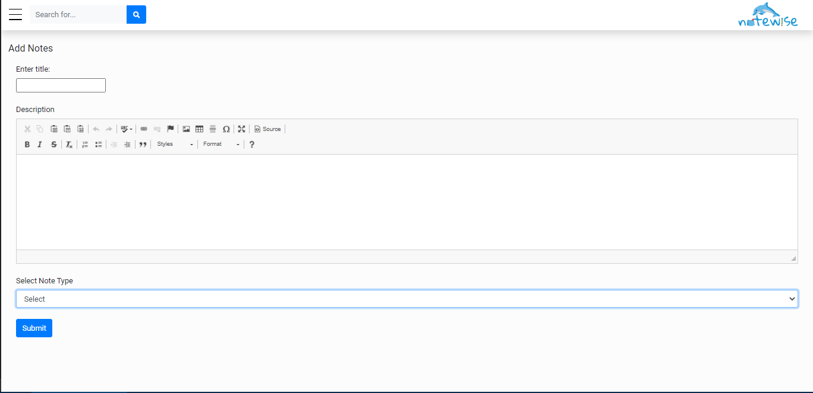
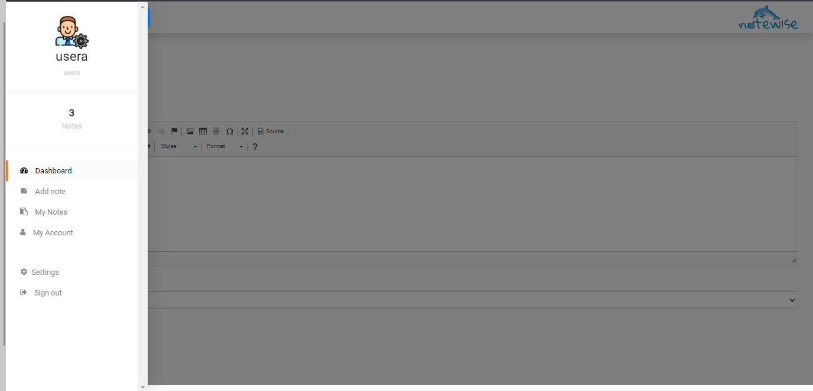
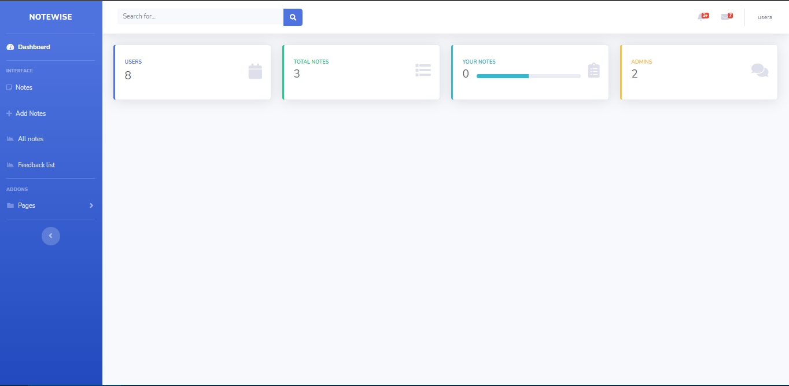
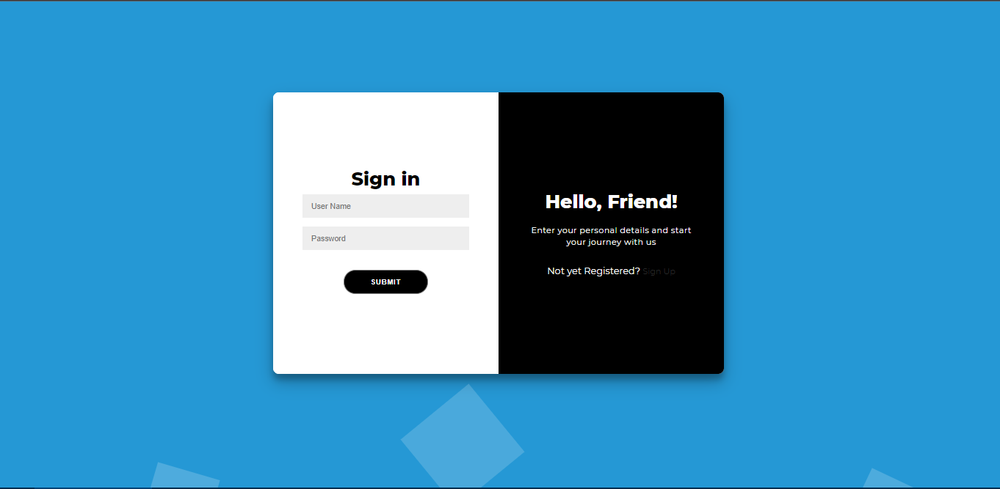

# Notewise: A notes management system
Notewise is a simple notes management system. It is suitable for users with less technical skills and workarounds for a notes system. It lets you add notes easily. 
There is admin, moderator and users as three users in the system to choose from. Each one with their own privileges.
User: Add private notes, see notes, comment notes
Moderator: Add private/public notes, see notes, comment notes
Admin: Perform CRUD ( Create, Read, Update and Delete) operations on notes, users.

## Screenshots

## Installing dependencies
- PHP >= 6.0
- PDO PHP Extension
- MySQL )= 5.6

## Download and Setup
- Clone the repo
- Install xammp/mamp or environment

## Use Notewise
- Notewise: http://localhost/notewise
(notewise here in the link refers to the folder name for cloned project)

| Username      | Password      |
| ------------- |:-------------:|
| admin         | admin |
| usera         | Qwertyui0p    |
